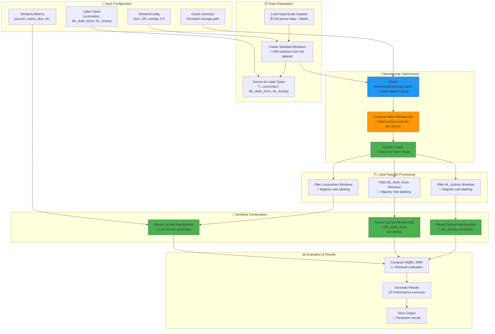
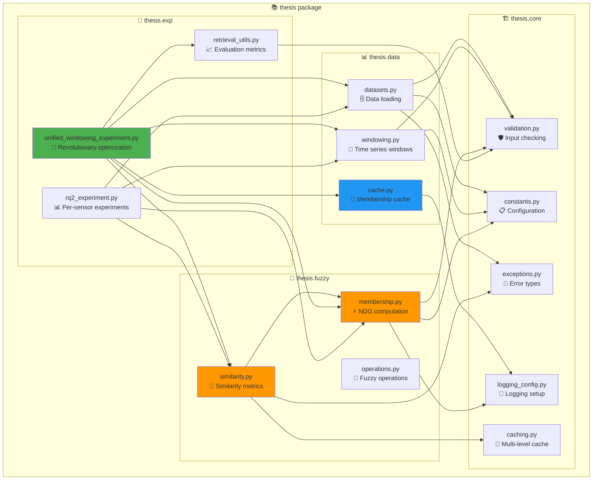

# System Architecture Diagrams

## Overall Thesis Codebase Architecture

```mermaid
graph TB
    subgraph UserInterface["👨‍💻 User Interface"]
        CLI[Command Line Interface]
        Scripts[Shell Scripts<br/>run_rq2_grid.sh]
        Notebooks[Jupyter Notebooks<br/>Analysis & Visualization]
    end
    
    subgraph ExperimentLayer["🧪 Experiment Layer"]
        UWE[UnifiedWindowingExperiment<br/>🚀 Revolutionary multi-label]
        RQ2[RQ2PerSensorExperiment<br/>Per-sensor classification]
        QuickTest[PerSensorQuickTest<br/>Rapid prototyping]
        RetrievalUtils[RetrievalUtils<br/>Hit@K, MRR evaluation]
    end
    
    subgraph DataLayer["📊 Data Layer"]
        Datasets[Datasets<br/>Opportunity, PAMAP2]
        Windowing[Windowing<br/>Sliding windows, majority vote]
        Cache[WindowMembershipCache<br/>💾 Persistent caching]
        Validation[Input Validation<br/>🛡️ Error checking]
    end
    
    subgraph FuzzyLayer["🧠 Fuzzy Logic Layer"]
        Membership[Membership Functions<br/>⚡ NDG + Epanechnikov]
        Similarity[Similarity Metrics<br/>🚀 Vectorized computation]
        Operations[Fuzzy Operations<br/>Set operations]
    end
    
    subgraph CoreInfrastructure["🏗️ Core Infrastructure"]
        Constants[Constants<br/>📋 Centralized config]
        Logging[Logging<br/>📝 Professional logging]
        Caching[Multi-level Caching<br/>💾 LRU + Disk]
        Exceptions[Exception Handling<br/>🚨 Specific errors]
    end
    
    subgraph Storage["💾 Storage & Results"]
        Results[Results Directory<br/>📈 Experiment outputs]
        Documentation[Documentation<br/>📚 Comprehensive docs]
        Cache_Storage[Cache Storage<br/>🗄️ Persistent membership functions]
    end
    
    %% User interactions
    CLI --> UWE
    CLI --> RQ2
    Scripts --> UWE
    Notebooks --> Results
    
    %% Experiment dependencies
    UWE --> Datasets
    UWE --> Windowing
    UWE --> Cache
    UWE --> Membership
    UWE --> Similarity
    UWE --> RetrievalUtils
    
    RQ2 --> Datasets
    RQ2 --> Windowing
    RQ2 --> Membership
    RQ2 --> Similarity
    
    %% Data layer interactions
    Datasets --> Validation
    Windowing --> Constants
    Cache --> Cache_Storage
    
    %% Fuzzy layer interactions
    Membership --> Constants
    Membership --> Logging
    Similarity --> Caching
    Similarity --> Exceptions
    
    %% Infrastructure
    Logging --> Documentation
    Results --> Documentation
    
    %% Styling
    style UWE fill:#4caf50
    style Cache fill:#2196f3
    style Membership fill:#ff9800
    style Similarity fill:#ff9800
    style Constants fill:#9c27b0
    style Cache_Storage fill:#607d8b
```

## Unified Windowing Experiment Architecture Detail



## Caching System Architecture

```mermaid
graph TB
    subgraph CacheArchitecture["💾 WindowMembershipCache Architecture"]
        
        subgraph Input["📥 Input Processing"]
            WindowData[Window Data<br/>numpy array]
            Config[Window Config<br/>size, overlap, etc.]
            HashFunction[SHA256 Hash<br/>🔑 Unique fingerprint]
        end
        
        subgraph Memory["🧠 Memory Cache"]
            LRUCache[LRU Cache<br/>Fast in-memory access]
            MemoryLimit[Memory Limit<br/>Configurable size]
        end
        
        subgraph Disk["💾 Disk Cache"]
            PickleStorage[Pickle Storage<br/>Persistent serialization]
            CacheDirectory[Cache Directory<br/>Organized file structure]
            AutoCleanup[Auto Cleanup<br/>Expiration management]
        end
        
        subgraph Operations["🔄 Cache Operations"]
            Get[get_membership()<br/>Retrieve cached result]
            Set[set_membership()<br/>Store computation]
            Save[save()<br/>Persist to disk]
            Load[load()<br/>Restore from disk]
            Clear[clear()<br/>Clean cache]
        end
        
        subgraph Performance["📊 Performance Monitoring"]
            HitRate[Cache Hit Rate<br/>Success percentage]
            Size[Cache Size<br/>Number of entries]
            Info[Cache Info<br/>Detailed statistics]
        end
        
        %% Connections
        WindowData --> HashFunction
        Config --> HashFunction
        HashFunction --> Get
        HashFunction --> Set
        
        Get --> LRUCache
        LRUCache --> MemoryLimit
        
        Set --> LRUCache
        LRUCache --> PickleStorage
        PickleStorage --> CacheDirectory
        
        Save --> PickleStorage
        Load --> LRUCache
        Clear --> CacheDirectory
        
        Get --> HitRate
        Set --> Size
        Save --> Info
        
        %% Styling
        style LRUCache fill:#2196f3
        style PickleStorage fill:#4caf50
        style HashFunction fill:#ff9800
        style HitRate fill:#9c27b0
    end
```

## Performance Optimization Stack

```mermaid
graph LR
    subgraph OptimizationLayers["🚀 Performance Optimization Stack"]
        
        subgraph Level1["Level 1: Algorithmic"]
            EpanechnikovKernel[Epanechnikov Kernel<br/>🎯 O(1) vs O(n) operations]
            VectorizedOps[Vectorized Operations<br/>⚡ NumPy broadcasting]
            SpatialIndexing[Spatial Indexing<br/>🗺️ cKDTree optimization]
        end
        
        subgraph Level2["Level 2: Caching"]
            MembershipCache[Membership Function Cache<br/>💾 Eliminate redundant computation]
            SimilarityCache[Similarity Matrix Cache<br/>🔄 Reuse expensive calculations]
            PersistentStorage[Persistent Storage<br/>🗄️ Cross-session benefits]
        end
        
        subgraph Level3["Level 3: Architecture"]
            UnifiedWindowing[Unified Windowing<br/>🏗️ Single computation, multiple uses]
            BatchProcessing[Batch Processing<br/>📦 Memory-efficient chunks]
            ParallelExecution[Parallel Execution<br/>🔀 Multi-core utilization]
        end
        
        subgraph Level4["Level 4: Implementation"]
            TypeHints[Type Hints<br/>🏷️ Compiler optimizations]
            ErrorHandling[Error Handling<br/>🛡️ Graceful degradation]
            Profiling[Performance Profiling<br/>📊 Continuous optimization]
        end
        
        %% Performance impact arrows
        EpanechnikovKernel -.-> |79x speedup| Level2
        VectorizedOps -.-> |10-100x speedup| Level2
        
        MembershipCache -.-> |2-3x speedup| Level3
        UnifiedWindowing -.-> |Zero redundancy| Level3
        
        BatchProcessing -.-> |Memory efficiency| Level4
        ParallelExecution -.-> |CPU utilization| Level4
        
        %% Total impact
        Level4 -.-> |Combined: ~200x| TotalSpeedup[🎯 Total Performance<br/>~200x speedup<br/>3-4 hours → 35 minutes]
        
        %% Styling
        style EpanechnikovKernel fill:#ff9800
        style MembershipCache fill:#2196f3
        style UnifiedWindowing fill:#4caf50
        style TotalSpeedup fill:#9c27b0
    end
```

## Module Dependency Graph



## Key Architectural Principles

### 1. 🏗️ **Separation of Concerns**
- **Data Layer**: Dataset loading, windowing, validation
- **Computation Layer**: Membership functions, similarity metrics
- **Experiment Layer**: Orchestration, evaluation, results
- **Infrastructure Layer**: Caching, logging, error handling

### 2. 💾 **Intelligent Caching Strategy**
- **Hash-based Indexing**: Fast lookup by content fingerprint
- **Multi-level Storage**: Memory (LRU) + Disk (persistent)
- **Automatic Management**: Cleanup, expiration, statistics
- **Cross-session Benefits**: Persistent storage across runs

### 3. ⚡ **Performance-First Design**
- **Vectorized Operations**: NumPy broadcasting for speed
- **Batch Processing**: Memory-efficient chunk processing
- **Lazy Evaluation**: Compute only when needed
- **Parallel Execution**: Multi-core utilization

### 4. 🛡️ **Robustness & Quality**
- **Comprehensive Validation**: Input checking at all levels
- **Graceful Error Handling**: Specific exceptions with context
- **Professional Logging**: Detailed progress tracking
- **Type Safety**: Full type hints for compiler optimization

### 5. 🔬 **Research-Oriented Architecture**
- **Modular Design**: Easy to extend and modify
- **Configuration-Driven**: Parameterized experiments
- **Reproducible Results**: Deterministic caching and evaluation
- **Publication-Ready**: Professional code quality and documentation