# Unified Windowing Process Diagram

## Traditional Multi-Label Approach (INEFFICIENT)


## Revolutionary Unified Windowing Approach (EFFICIENT)

```mermaid
graph TD
    A[Opportunity Dataset] --> B[Create Standard Windows<br/>850 windows from full dataset]
    
    B --> C[💾 Compute Membership Functions<br/>ONCE for all 850 windows<br/>⚡ Epanechnikov kernel + caching]
    
    C --> D1[Filter for Locomotion<br/>628 windows with majority vote]
    C --> D2[Filter for ML_Both_Arms<br/>77 windows with majority vote]
    C --> D3[Filter for HL_Activity<br/>591 windows with majority vote]
    
    D1 --> E1[🔄 Reuse Cached Membership<br/>for Similarities & Results]
    D2 --> E2[🔄 Reuse Cached Membership<br/>for Similarities & Results]
    D3 --> E3[🔄 Reuse Cached Membership<br/>for Similarities & Results]
    
    style C fill:#ccffcc
    style E1 fill:#ccffcc
    style E2 fill:#ccffcc
    style E3 fill:#ccffcc
    
    F[✅ SOLUTION:<br/>850 membership computations<br/>100% cache reuse<br/>~35 minutes execution time<br/>🚀 ~200x speedup]
    
    C -.-> F
```



## Detailed Unified Windowing Workflow

```mermaid
flowchart LR
    subgraph Input["🗄️ Input Data"]
        DS[Opportunity Dataset<br/>Sensor Data + Labels]
    end
    
    subgraph StandardWindows["📦 Standard Window Creation"]
        SW[Create 850 Standard Windows<br/>Fixed size: 120<br/>Overlap: 50%]
        TS[Track Window Timestamps<br/>for Label Mapping]
    end
    
    subgraph MembershipComputation["⚡ Membership Computation"]
        MC[Compute NDG Membership<br/>Epanechnikov Kernel<br/>Per-Sensor Approach]
        CACHE[💾 Cache Results<br/>Hash-based Storage<br/>Persistent Disk Cache]
    end
    
    subgraph LabelFiltering["🏷️ Label-Specific Filtering"]
        L1[Locomotion Filtering<br/>Majority Vote Labeling<br/>Remove 'Unknown']
        L2[ML_Both_Arms Filtering<br/>Majority Vote Labeling<br/>Remove 'Unknown']
        L3[HL_Activity Filtering<br/>Majority Vote Labeling<br/>Remove 'Unknown']
    end
    
    subgraph SimilarityComputation["🔄 Similarity Computation"]
        S1[Locomotion Similarities<br/>Reuse Cached Membership]
        S2[ML_Both_Arms Similarities<br/>Reuse Cached Membership]
        S3[HL_Activity Similarities<br/>Reuse Cached Membership]
    end
    
    subgraph Results["📊 Results & Evaluation"]
        R1[Hit@K, MRR<br/>Locomotion Results]
        R2[Hit@K, MRR<br/>ML_Both_Arms Results]
        R3[Hit@K, MRR<br/>HL_Activity Results]
        SUMMARY[Multi-Label<br/>Performance Summary]
    end
    
    DS --> SW
    SW --> TS
    TS --> MC
    MC --> CACHE
    
    CACHE --> L1
    CACHE --> L2
    CACHE --> L3
    
    L1 --> S1
    L2 --> S2
    L3 --> S3
    
    S1 --> R1
    S2 --> R2
    S3 --> R3
    
    R1 --> SUMMARY
    R2 --> SUMMARY
    R3 --> SUMMARY
    
    style MC fill:#ffeb3b
    style CACHE fill:#4caf50
    style S1 fill:#2196f3
    style S2 fill:#2196f3
    style S3 fill:#2196f3
```

## Key Optimization Insights

### 1. Window Reuse Strategy
- **Standard Windows**: Create windows from entire dataset ONCE
- **Label Filtering**: Apply different label types to same windows
- **Zero Redundancy**: Each unique window processed exactly once

### 2. Caching Architecture
- **Hash-based Indexing**: Fast lookup by window content
- **Persistent Storage**: Benefits carry across experiment sessions
- **Memory Efficient**: Configurable cache directory structure

### 3. Performance Breakthrough
- **79x Speedup**: Epanechnikov kernel + vectorization
- **2-3x Speedup**: Membership function caching
- **Combined**: ~200x total speedup for multi-label experiments

### 4. Quality Preservation
- **Majority Vote Labeling**: Robust activity recognition
- **Ambiguous Window Filtering**: Remove uncertain labels
- **Consistent Methodology**: Same approach across all label types