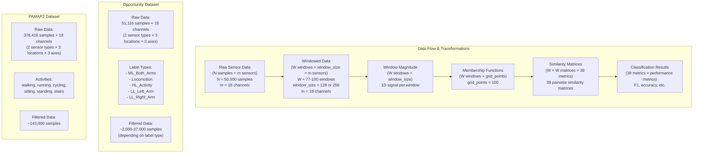

```mermaid
graph TD
    subgraph "Data Flow & Transformations"
        A["Raw Sensor Data<br/>(N samples × m sensors)<br/>N ≈ 50,000 samples<br/>m = 18 channels"] --> B["Windowed Data<br/>(W windows × window_size × m sensors)<br/>W ≈ 77-100 windows<br/>window_size = 128 or 256<br/>m = 18 channels"]
        B --> C["Window Magnitude<br/>(W windows × window_size)<br/>1D signal per window"]
        C --> D["Membership Functions<br/>(W windows × grid_points)<br/>grid_points = 100"]
        D --> E["Similarity Matrices<br/>(W × W matrices × 38 metrics)<br/>38 pairwise similarity matrices"]
        E --> F["Classification Results<br/>(38 metrics × performance metrics)<br/>F1, accuracy, etc."]
    end
    
    subgraph "Opportunity Dataset"
        O1["Raw Data:<br/>51,116 samples × 18 channels<br/>(2 sensor types × 3 locations × 3 axes)"]
        O2["Label Types:<br/>- ML_Both_Arms<br/>- Locomotion<br/>- HL_Activity<br/>- LL_Left_Arm<br/>- LL_Right_Arm"]
        O3["Filtered Data:<br/>~2,000-37,000 samples<br/>(depending on label type)"]
    end
    
    subgraph "PAMAP2 Dataset"
        P1["Raw Data:<br/>376,416 samples × 18 channels<br/>(2 sensor types × 3 locations × 3 axes)"]
        P2["Activities:<br/>walking, running, cycling,<br/>sitting, standing, stairs"]
        P3["Filtered Data:<br/>~143,000 samples"]
    end
``` 