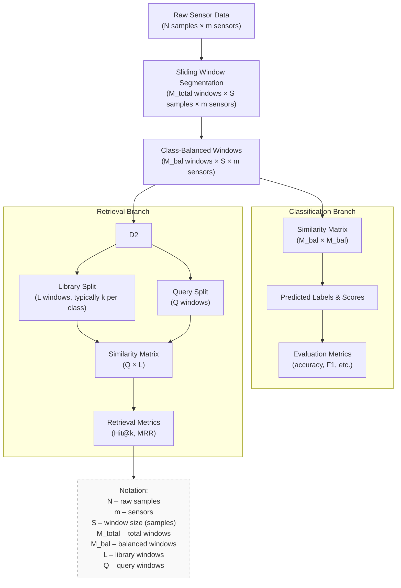

```mermaid
graph TD
    %% Abstract dataset size diagram for RQ2 pipeline
    
    %% Raw data
    A["Raw Sensor Data<br/>(N samples × m sensors)"]
    A --> B
    
    %% Windowing
    B["Sliding Window Segmentation<br/>(M_total windows × S samples × m sensors)"]
    B --> C

    %% Class balancing
    C["Class-Balanced Windows<br/>(M_bal windows × S × m sensors)"]
    C --> D1
    C --> D2

    %% Classification branch
    subgraph "Classification Branch"
        D1["Similarity Matrix<br/>(M_bal × M_bal)"] --> E1
        E1["Predicted Labels & Scores"] --> F1["Evaluation Metrics<br/>(accuracy, F1, etc.)"]
    end

    %% Retrieval branch
    subgraph "Retrieval Branch"
        D2 --> G1["Library Split<br/>(L windows, typically k per class)"]
        D2 --> G2["Query Split<br/>(Q windows)"]
        G1 --> H["Similarity Matrix<br/>(Q × L)"]
        G2 --> H
        H --> I["Retrieval Metrics<br/>(Hit@k, MRR)"]
    end

    %% Notes
    classDef note fill:#f9f9f9,stroke:#aaa,stroke-dasharray: 5 5;
    J1["Notation:<br/>N – raw samples<br/>m – sensors<br/>S – window size (samples)<br/>M_total – total windows<br/>M_bal – balanced windows<br/>L – library windows<br/>Q – query windows"]:::note
    I --> J1
``` 